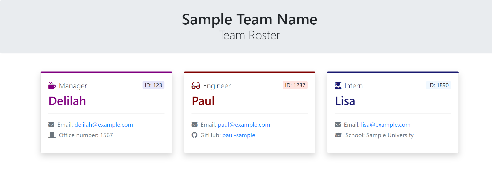

# Bootcamp - Homework 8: Team Roster Generator

A command line program which generates a webpage of software engineering team's roster.

According to the acceptance criteria, a team consists of one Manager and any number of Interns and/or Engineers. As such, the prompts will begin Manager-specific information first before allowing the user to add Interns/Engineers.

A user story, acceptance criteria, tests and starter code were given for this assignment. The starter code contained the structure for the overall program and a fully-written function for stitching together the HTML templates.

## Purpose
According to the user story, this application is meant for managers who wish to have access to their team's basic info via a web page.

## Installation
This application uses [Inquirer](https://www.npmjs.com/package/inquirer) and [Jest](https://jestjs.io/en/). Be sure to run `npm install` before using it.

## Usage
:link: [View demo](https://drive.google.com/file/d/1eo02RRlXICWNRjVYRMWe0dfZa8usLPZ_/view?usp=sharing)

To run the application, run `node app`.

The program is fairly straightforward and will begin with some information on what to expect when generating a roster.

No prompts can be left blank, and some prompts may have additional validation (ex. ensuring proper email format).

The exported file can be found in `output/` named: `team.html`. The output directory will be generated when using the program for the first time.

### :warning: Additional Notes on Usage
- If there is an existing `team.html` file in `output/`, generating a new team roster will overwrite the existing one. Be sure to remove the existing `team.html` file if you don't want it to be overwritten.

## Built with
- [Node.js](https://nodejs.org/en/)
- [Inquirer](https://www.npmjs.com/package/inquirer)
- [Bootstrap 4.5](https://getbootstrap.com/)
- [Font Awesome 5](https://fontawesome.com/)

## Tested with
- [Jest](https://jestjs.io/en/)

This homework assignment is part of the [Carleton University Coding Bootcamp](https://bootcamp.carleton.ca/).
